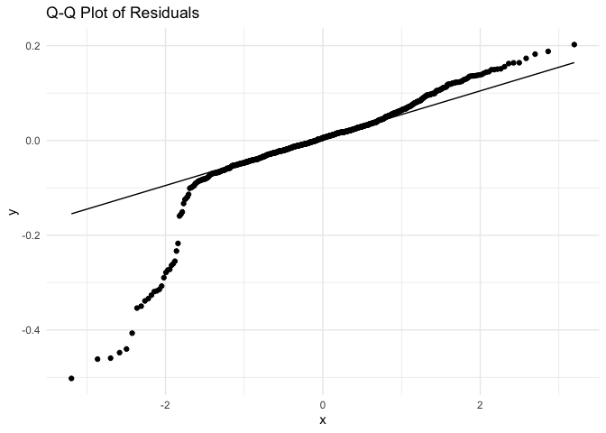

Geog6300: Lab 6 Amit Kaushik
================

## Regression

``` r
library(sf)
library(tidyverse)
```

**Overview:** This lab focuses on regression techniques. You’ll be
analyzing the association of various physical and climatological
characteristics in Australia with observations of several animals
recorded on the citizen science app iNaturalist.

\###Data and research questions###

Let’s import the dataset.

``` r
lab6_data<-st_read("data/aus_climate_inat.gpkg")
```

    ## Reading layer `aus_climate_inat' from data source 
    ##   `/Users/amitkaushik/Library/CloudStorage/OneDrive-UniversityofGeorgia/1_Projects/Project_PhD/02_PhD_Learnbook/9_Fall_2024/GEOG6300_DataScience_Geography/Lab06/data/aus_climate_inat.gpkg' 
    ##   using driver `GPKG'
    ## Simple feature collection with 716 features and 22 fields
    ## Geometry type: POLYGON
    ## Dimension:     XY
    ## Bounding box:  xmin: 113.875 ymin: -43.38632 xmax: 153.375 ymax: -11.92074
    ## Geodetic CRS:  WGS 84 (CRS84)

The dataset for this lab is a 1 decimal degree hexagon grid that has
aggregate statistics for a number of variables:

- ndvi: NDVI/vegetation index values from Landsat data (via Google Earth
  Engine). These values range from -1 to 1, with higher values
  indicating more vegetation.
- maxtemp_00/20_med: Median maximum temperature (C) in 2000 or 2020
  (data from SILO/Queensland government)
- mintemp_00/20_med: Median minimum temperature (C) in 2020 or 2020
  (data from SILO/Queensland government)
- rain_00/20_sum: Total rainfall (mm) in 2000 or 2020 (data from
  SILO/Queensland government)
- pop_00/20: Total population in 2000 or 2020 (data from NASA’s Gridded
  Population of the World)
- water_00/20_pct: Percentage of land covered by water at some point
  during the year in 2000 or 2020
- elev_med: Median elevation (meters) (data from the Shuttle Radar
  Topography Mission/NASA)

There are also observation counts from iNaturalist for several
distinctively Australian animal species: the central bearded dragon, the
common emu, the red kangaroo, the agile wallaby, the laughing
kookaburra, the wombat, the koala, and the platypus.

Our primary research question is how the climatological/physical
variables in our dataset are predictive of the NDVI value. We will build
models for 2020 as well as the change from 2000 to 2020. The second is
referred to as a “first difference” model and can sometimes be more
useful for identifying causal mechanisms.

\###Part 1: Analysis of 2020 data###

We will start by looking at data for 2020.

**Question 1** *Create histograms for NDVI, max temp., min temp., rain,
and population, and water in 2020 as well as elevation. Based on these
graphs, assess the normality of these variables.*

``` r
library(ggplot2)
library(tidyverse)

# Histogram and Q-Q plot for NDVI, max temp., min temp., rain, and population, and water in 2020 as well as elevation 

##for NDVI
hist(lab6_data$ndvi_20_med, main = "Histogram of NDVI 2020", xlab = "NDVI")
```

<!-- -->

``` r
ggplot(lab6_data, aes(sample = ndvi_20_med)) +
  stat_qq() + 
  stat_qq_line() +
  ggtitle("Q-Q plot for NDVI 2020")
```

<!-- -->

``` r
##for Max Temperature
hist(lab6_data$maxtemp_20_med, main = "Histogram of Max Temp. 2020", xlab = "Max Temp.")
```

<!-- -->

``` r
ggplot(lab6_data, aes(sample = maxtemp_20_med)) +
  stat_qq() + 
  stat_qq_line() +
  ggtitle("Q-Q plot for Max Temp. 2020")
```

<!-- -->

``` r
##for Min Temperature
hist(lab6_data$mintemp_20_med, main = "Histogram of Min Temp. 2020", xlab = "Min Temp.")
```

<!-- -->

``` r
ggplot(lab6_data, aes(sample = mintemp_20_med)) +
  stat_qq() + 
  stat_qq_line() +
  ggtitle("Q-Q plot for Min Temp. 2020")
```

<!-- -->

``` r
##for Rainfall
hist(lab6_data$rain_20_sum, main = "Histogram of Rainfall 2020", xlab = "Rainfall")
```

<!-- -->

``` r
ggplot(lab6_data, aes(sample = rain_20_sum)) +
  stat_qq() + 
  stat_qq_line() +
  ggtitle("Q-Q plot for Rainfall 2020")
```

<!-- -->

``` r
##Hfor Population
hist(lab6_data$pop_20, main = "Histogram of Population 2020", xlab = "Population")
```

<!-- -->

``` r
ggplot(lab6_data, aes(sample = pop_20)) +
  stat_qq() + 
  stat_qq_line() +
  ggtitle("Q-Q plot for Population 2020")
```

<!-- -->

``` r
##for Water Percentage
hist(lab6_data$water_20_pct, main = "Histogram of Water Percentage 2020", xlab = "Water Percentage")
```

<!-- -->

``` r
ggplot(lab6_data, aes(sample = water_20_pct)) +
  stat_qq() + 
  stat_qq_line() +
  ggtitle("Q-Q plot for Water Percentage 2020")
```

<!-- -->

``` r
##for Elevation
hist(lab6_data$elev_med, main = "Histogram of Elevation 2020", xlab = "Elevation")
```

<!-- -->

``` r
ggplot(lab6_data, aes(sample = elev_med)) +
  stat_qq() + 
  stat_qq_line() +
  ggtitle("Q-Q plot for Elevation 2020")
```

<!-- -->

Based on the histograms and QQ plots in Question 1, the normality of the
variables in the 2020 dataset shows a mix of patterns. For NDVI and
rainfall, the histograms appear roughly symmetrical, but both show some
skew, especially with NDVI, which is slightly positively skewed. The QQ
plots for NDVI also deviate from the straight line, suggesting it does
not follow a perfect normal distribution. On the other hand, temperature
variables (max and min) display right-skewed distributions, indicating
that higher temperatures are less frequent but more extreme values are
present. The QQ plots further confirm this skew, with significant
deviations from normality. Population, water percentage, and elevation
all show heavy skew, especially population data, which is highly
right-skewed with a long tail indicating the presence of a few areas
with very high population densities. Water percentage also shows a
concentrated peak near zero, with few areas having higher values, and
elevation is skewed, with most data concentrated in lower elevations.
These variables do not follow a normal distribution and would likely
require further tests for normality if used in parametric models.

**Question 2** *Use tmap to map these same variables using Jenks natural
breaks as the classification method. For an extra challenge, use
`tmap_arrange` to plot all maps in a single figure.*

``` r
# Load the necessary libraries
library(tmap)
```

    ## Breaking News: tmap 3.x is retiring. Please test v4, e.g. with
    ## remotes::install_github('r-tmap/tmap')

``` r
library(sf)
library(tidyverse)

# NDVI 2020 Map
map_ndvi <- tm_shape(lab6_data) +
  tm_fill("ndvi_20_med", style = "jenks", palette = "RdYlGn", title = "NDVI 2020") +
  tm_borders() +
  tm_layout(main.title = "NDVI 2020", legend.position = c("left", "bottom"))
map_ndvi
```

<!-- -->

``` r
# Max Temperature 2020 Map
map_maxtemp <- tm_shape(lab6_data) +
  tm_fill("maxtemp_20_med", style = "jenks", palette = "YlOrRd", title = "Max Temp. 2020") +
  tm_borders() +
  tm_layout(main.title = "Max Temperature 2020", legend.position = c("left", "bottom"))
map_maxtemp
```

<!-- -->

``` r
# Min Temperature 2020 Map
map_mintemp <- tm_shape(lab6_data) +
  tm_fill("mintemp_20_med", style = "jenks", palette = "YlGnBu", title = "Min Temp. 2020") +
  tm_borders() +
  tm_layout(main.title = "Min Temperature 2020", legend.position = c("left", "bottom"))
map_mintemp
```

<!-- -->

``` r
# Rainfall 2020 Map
map_rainfall <- tm_shape(lab6_data) +
  tm_fill("rain_20_sum", style = "jenks", palette = "Blues", title = "Rainfall 2020") +
  tm_borders() +
  tm_layout(main.title = "Rainfall 2020", legend.position = c("left", "bottom"))
map_rainfall
```

<!-- -->

``` r
# Population 2020 Map
map_population <- tm_shape(lab6_data) +
  tm_fill("pop_20", style = "jenks", palette = "YlOrBr", title = "Population 2020") +
  tm_borders() +
  tm_layout(main.title = "Population 2020", legend.position = c("left", "bottom"))
map_population
```

<!-- -->

``` r
# Water Percentage 2020 Map
map_water <- tm_shape(lab6_data) +
  tm_fill("water_20_pct", style = "jenks", palette = "Purples", title = "Water % 2020") +
  tm_borders() +
  tm_layout(main.title = "Water Percentage 2020", legend.position = c("left", "bottom"))
map_water
```

<!-- -->

``` r
# Elevation Map
map_elevation <- tm_shape(lab6_data) +
  tm_fill("elev_med", style = "jenks", palette = "Greens", title = "Elevation 2020") +
  tm_borders() +
  tm_layout(main.title = "Elevation 2020", legend.position = c("left", "bottom"))
map_elevation
```

<!-- -->

``` r
# Combining all the maps into one figure using tmap_arrange
tmap_arrange(map_ndvi, map_maxtemp, map_mintemp, map_rainfall, map_population, map_water, map_elevation, ncol = 2)
```

<!-- -->

**Question 3** *Based on the maps from question 3, summarise major
patterns you see in the spatial distribution of these data from any of
your variables of interest. How do they appear to be associated with the
NDVI variable?*

The spatial patterns observed in the maps show clear geographic trends
for for NDVI, max temp., min temp., rain, and population, and water in
2020 and elevation in Australia. Mapping these different variables
indicate different spatial patterns, highlighting the complex interplay
between climate, topography, and human activities in shaping Australia’s
landscape, which would theoretically have an impact on where which
species is found. High NDVI values, indicative of healthy vegetation,
are concentrated in the eastern coastal regions, particularly in
Queensland and New South Wales, where rainfall is abundant and
temperatures are moderate. Conversely, the arid interior regions exhibit
low NDVI values, reflecting sparse vegetation and harsh climatic
conditions. Maximum temperatures are highest in the arid interior,
aligning with the low NDVI values. Coastal regions, especially in the
south and east, experience lower maximum temperatures due to the
moderating influence of the ocean. Minimum temperatures are lowest in
the mountainous regions of southeastern Australia, particularly the
Great Dividing Range. Rainfall patterns show a clear contrast between
the wet coastal regions and the dry interior. High rainfall is
concentrated along the eastern and northeastern coasts, while the
interior regions receive significantly less rainfall. This pattern
directly impacts vegetation health and NDVI values. Population density
is highest along the eastern and southern coasts, particularly in major
cities like Sydney, Melbourne, and Brisbane. The interior regions are
sparsely populated due to harsh climatic conditions and limited
resources. Water percentage is highest in coastal regions, especially in
the north and east, where rivers, lakes, and wetlands are abundant. The
interior regions, characterized by arid and semi-arid climates, have
significantly lower water percentages. Elevation patterns show higher
elevations in the Great Dividing Range and lower elevations in the
coastal plains and interior lowlands. Elevation can influence
temperature, precipitation, and vegetation patterns, indirectly
affecting NDVI values.

**Question 4** *Create univariate models for each of the variables
listed in question 1, with NDVI in 2020 as the dependent variable. Print
a summary of each model. Write a summary of those results that indicates
the direction, magnitude, and significance for each model coefficient.*

``` r
# Load necessary libraries
library(tidyverse)

# univariate models for each variable with NDVI as the dependent variable
model_ndvi_maxtemp <- lm(ndvi_20_med ~ maxtemp_20_med, data = lab6_data)
summary(model_ndvi_maxtemp)
```

    ## 
    ## Call:
    ## lm(formula = ndvi_20_med ~ maxtemp_20_med, data = lab6_data)
    ## 
    ## Residuals:
    ##      Min       1Q   Median       3Q      Max 
    ## -0.41874 -0.07657 -0.01927  0.06833  0.36382 
    ## 
    ## Coefficients:
    ##                  Estimate Std. Error t value Pr(>|t|)    
    ## (Intercept)     0.6612389  0.0294372   22.46   <2e-16 ***
    ## maxtemp_20_med -0.0130902  0.0009601  -13.63   <2e-16 ***
    ## ---
    ## Signif. codes:  0 '***' 0.001 '**' 0.01 '*' 0.05 '.' 0.1 ' ' 1
    ## 
    ## Residual standard error: 0.1251 on 714 degrees of freedom
    ## Multiple R-squared:  0.2066, Adjusted R-squared:  0.2055 
    ## F-statistic: 185.9 on 1 and 714 DF,  p-value: < 2.2e-16

``` r
model_ndvi_mintemp <- lm(ndvi_20_med ~ mintemp_20_med, data = lab6_data)
summary(model_ndvi_mintemp)
```

    ## 
    ## Call:
    ## lm(formula = ndvi_20_med ~ mintemp_20_med, data = lab6_data)
    ## 
    ## Residuals:
    ##      Min       1Q   Median       3Q      Max 
    ## -0.36375 -0.08418 -0.03047  0.06972  0.40383 
    ## 
    ## Coefficients:
    ##                 Estimate Std. Error t value Pr(>|t|)    
    ## (Intercept)     0.464461   0.018997   24.45   <2e-16 ***
    ## mintemp_20_med -0.012282   0.001131  -10.86   <2e-16 ***
    ## ---
    ## Signif. codes:  0 '***' 0.001 '**' 0.01 '*' 0.05 '.' 0.1 ' ' 1
    ## 
    ## Residual standard error: 0.1301 on 714 degrees of freedom
    ## Multiple R-squared:  0.1418, Adjusted R-squared:  0.1406 
    ## F-statistic:   118 on 1 and 714 DF,  p-value: < 2.2e-16

``` r
model_ndvi_rain <- lm(ndvi_20_med ~ rain_20_sum, data = lab6_data)
summary(model_ndvi_rain)
```

    ## 
    ## Call:
    ## lm(formula = ndvi_20_med ~ rain_20_sum, data = lab6_data)
    ## 
    ## Residuals:
    ##      Min       1Q   Median       3Q      Max 
    ## -0.56681 -0.04753 -0.01210  0.04599  0.30930 
    ## 
    ## Coefficients:
    ##              Estimate Std. Error t value Pr(>|t|)    
    ## (Intercept) 1.303e-01  7.060e-03   18.45   <2e-16 ***
    ## rain_20_sum 9.124e-07  3.953e-08   23.08   <2e-16 ***
    ## ---
    ## Signif. codes:  0 '***' 0.001 '**' 0.01 '*' 0.05 '.' 0.1 ' ' 1
    ## 
    ## Residual standard error: 0.1063 on 714 degrees of freedom
    ## Multiple R-squared:  0.4273, Adjusted R-squared:  0.4265 
    ## F-statistic: 532.6 on 1 and 714 DF,  p-value: < 2.2e-16

``` r
model_ndvi_pop <- lm(ndvi_20_med ~ pop_20, data = lab6_data)
summary(model_ndvi_pop)
```

    ## 
    ## Call:
    ## lm(formula = ndvi_20_med ~ pop_20, data = lab6_data)
    ## 
    ## Residuals:
    ##      Min       1Q   Median       3Q      Max 
    ## -0.47003 -0.07883 -0.03949  0.06384  0.48974 
    ## 
    ## Coefficients:
    ##              Estimate Std. Error t value Pr(>|t|)    
    ## (Intercept) 2.552e-01  5.013e-03  50.902   <2e-16 ***
    ## pop_20      1.500e-06  1.500e-07   9.998   <2e-16 ***
    ## ---
    ## Signif. codes:  0 '***' 0.001 '**' 0.01 '*' 0.05 '.' 0.1 ' ' 1
    ## 
    ## Residual standard error: 0.1316 on 714 degrees of freedom
    ## Multiple R-squared:  0.1228, Adjusted R-squared:  0.1216 
    ## F-statistic: 99.97 on 1 and 714 DF,  p-value: < 2.2e-16

``` r
model_ndvi_water <- lm(ndvi_20_med ~ water_20_pct, data = lab6_data)
summary(model_ndvi_water)
```

    ## 
    ## Call:
    ## lm(formula = ndvi_20_med ~ water_20_pct, data = lab6_data)
    ## 
    ## Residuals:
    ##      Min       1Q   Median       3Q      Max 
    ## -0.26898 -0.08838 -0.04838  0.06871  0.50911 
    ## 
    ## Coefficients:
    ##               Estimate Std. Error t value Pr(>|t|)    
    ## (Intercept)   0.268988   0.006287  42.781   <2e-16 ***
    ## water_20_pct -0.178263   0.154480  -1.154    0.249    
    ## ---
    ## Signif. codes:  0 '***' 0.001 '**' 0.01 '*' 0.05 '.' 0.1 ' ' 1
    ## 
    ## Residual standard error: 0.1403 on 714 degrees of freedom
    ## Multiple R-squared:  0.001862,   Adjusted R-squared:  0.0004636 
    ## F-statistic: 1.332 on 1 and 714 DF,  p-value: 0.2489

``` r
model_ndvi_elev <- lm(ndvi_20_med ~ elev_med, data = lab6_data)
summary(model_ndvi_elev)
```

    ## 
    ## Call:
    ## lm(formula = ndvi_20_med ~ elev_med, data = lab6_data)
    ## 
    ## Residuals:
    ##      Min       1Q   Median       3Q      Max 
    ## -0.27082 -0.09585 -0.04270  0.07954  0.44272 
    ## 
    ## Coefficients:
    ##              Estimate Std. Error t value Pr(>|t|)    
    ## (Intercept) 2.138e-01  9.741e-03  21.952  < 2e-16 ***
    ## elev_med    1.787e-04  2.895e-05   6.171 1.14e-09 ***
    ## ---
    ## Signif. codes:  0 '***' 0.001 '**' 0.01 '*' 0.05 '.' 0.1 ' ' 1
    ## 
    ## Residual standard error: 0.1369 on 714 degrees of freedom
    ## Multiple R-squared:  0.05064,    Adjusted R-squared:  0.04931 
    ## F-statistic: 38.08 on 1 and 714 DF,  p-value: 1.136e-09

The results of the univariate regression models show varying
relationships between NDVI in 2020 and different predictor variables,
including max temp., min temp., rain, and population, and water in 2020
and elevation. The relationship between minimum temperature
(mintemp_20_med) and NDVI is negative, with every 1°C increase in
minimum temperature corresponding to a decrease of 0.01228 in NDVI. This
relationship is statistically highly significant (p-value \< 2e-16),
although the model explains only about 14% of the variation in NDVI,
indicating a relatively weak association. On the other hand, rainfall
(rain_20_sum) exhibits a positive relationship with NDVI, where each 1
mm increase in total rainfall results in an increase of 9.124e-07 in
NDVI. This relationship is also highly significant (p-value \< 2e-16),
and the model explains approximately 43% of the variation in NDVI,
suggesting a moderate positive impact of rainfall on vegetation health.
The relationship between population (pop_20) and NDVI is positive, with
each additional person in the population corresponding to a small
increase in NDVI (1.500e-06). This relationship is statistically
significant (p-value \< 2e-16), but the model explains only about 12% of
the variation in NDVI, indicating a weak association. Water percentage
(water_20_pct), however, shows a negative coefficient, where a 1%
increase in water coverage corresponds to a decrease of 0.178263 in
NDVI, though this relationship is not statistically significant (p-value
= 0.249), suggesting that water coverage does not meaningfully affect
NDVI in 2020. Finally, elevation (elev_med) has a small but positive
relationship with NDVI, where each 1-meter increase in median elevation
leads to a slight increase in NDVI (0.0001787). This relationship is
highly significant (p-value = 1.14e-09), but the model explains only
about 5% of the variation in NDVI, indicating that elevation has a weak
but significant positive influence on vegetation health. From these
univariate regression models, I found that temperature, rainfall, and
population show significant relationships with NDVI, while water
coverage does not appear to have a meaningful impact, and elevation,
while significant, has only a small effect on NDVI.

**Question 5** *Create a multivariate regression model with the
variables of interest, choosing EITHER max or min temperature (but not
both) You may also choose to leave out any variables that were
insignificant in Q4. Use the univariate models as your guide. Call the
results.*

``` r
library(tidyverse)

# Choosing variables based on univariate models and keeping max temperature (maxtemp_20_med) for the multivariate regression model. I excluded population which was insignificant in Q4.

model_multivariate <- lm(ndvi_20_med ~ maxtemp_20_med + rain_20_sum + water_20_pct + elev_med, data = lab6_data)
summary(model_multivariate)
```

    ## 
    ## Call:
    ## lm(formula = ndvi_20_med ~ maxtemp_20_med + rain_20_sum + water_20_pct + 
    ##     elev_med, data = lab6_data)
    ## 
    ## Residuals:
    ##      Min       1Q   Median       3Q      Max 
    ## -0.50232 -0.02897  0.00546  0.03840  0.20225 
    ## 
    ## Coefficients:
    ##                  Estimate Std. Error t value Pr(>|t|)    
    ## (Intercept)     4.736e-01  2.220e-02  21.331  < 2e-16 ***
    ## maxtemp_20_med -1.228e-02  6.566e-04 -18.694  < 2e-16 ***
    ## rain_20_sum     8.692e-07  3.177e-08  27.361  < 2e-16 ***
    ## water_20_pct   -2.604e-02  9.758e-02  -0.267     0.79    
    ## elev_med        1.231e-04  1.870e-05   6.580 9.12e-11 ***
    ## ---
    ## Signif. codes:  0 '***' 0.001 '**' 0.01 '*' 0.05 '.' 0.1 ' ' 1
    ## 
    ## Residual standard error: 0.08494 on 711 degrees of freedom
    ## Multiple R-squared:  0.6359, Adjusted R-squared:  0.6338 
    ## F-statistic: 310.4 on 4 and 711 DF,  p-value: < 2.2e-16

**Question 6** *Summarize the results of the multivariate model. What
are the direction, magnitude, and significance of each coefficient? How
did it change from the univariate models you created in Q4 (if at all)?
What do the R2 and F-statistic values tell you about overall model fit?*

The multivariate regression model examines the relationship between NDVI
in 2020 and several independent variables, including maximum temperature
(maxtemp_20_med), rainfall (rain_20_sum), water percentage
(water_20_pct), and elevation (elev_med). The intercept of the model is
0.4736, representing the expected NDVI when all predictors are zero, and
is highly significant with a p-value less than 2e-16. For maximum
temperature, the coefficient is -0.01228, indicating that for each 1°C
increase in maximum temperature, NDVI decreases by 0.01228 units. This
relationship is statistically significant (p-value \< 2e-16), and aligns
with the univariate model from Question 4, where temperature showed a
negative association with NDVI. Similarly, rainfall has a positive
relationship with NDVI, with a coefficient of 8.692e-07, meaning that
for each additional millimeter of rainfall, NDVI increases by a very
small amount (8.692e-07). This effect is statistically significant
(p-value \< 2e-16), consistent with the univariate model. Water
percentage, however, does not show a significant effect on NDVI in the
multivariate model. The coefficient is -0.02604, suggesting a small
negative relationship, but the p-value is 0.79, indicating that water
percentage is not a significant predictor of NDVI when controlling for
other factors. This lack of significance mirrors the result from the
univariate model in Question 4, where water percentage was also not a
significant predictor. Elevation has a coefficient of 0.0001231, meaning
that for each 1-meter increase in elevation, NDVI increases by a small
amount. This relationship is statistically significant (p-value =
9.12e-11) and is consistent with the univariate result, where elevation
showed a positive but small effect on NDVI.

In comparison to the univariate models, the multivariate model shows an
improved overall fit, explaining 63.59% of the variance in NDVI
(Multiple R-squared). This is a significant improvement over the
individual univariate models, where the R-squared values ranged from 12%
to 43%. The Adjusted R-squared value of 63.38% indicates that the model
accounts for a substantial amount of variability in NDVI, considering
the number of predictors. The F-statistic of 310.4 with a p-value less
than 2.2e-16 confirms that the model as a whole is statistically
significant. I think the multivariate model provides a more
comprehensive explanation of NDVI in 2020, with maximum temperature,
rainfall, and elevation all showing significant effects. Water
percentage, however, is not significant in this context. The model’s
high R-squared and statistically significant F-statistic suggest that it
offers valuable insights into the factors influencing NDVI, though
further model refinement may be necessary to exclude insignificant
predictors and improve the explanatory power.

**Question 7** *Use a histogram and a map to assess the normality of
residuals and any spatial autocorrelation. Summarise any notable
patterns that you see.*

``` r
options(repos = c(CRAN = "https://cran.r-project.org"))
library(ggplot2)
library(tmap)
library(sf)

model_multivariate <- lm(ndvi_20_med ~ maxtemp_20_med + rain_20_sum + water_20_pct + elev_med, data = lab6_data)

residuals <- residuals(model_multivariate) ## Extracting residuals from the model

# Creating a histogram of the residuals to assess normality; and creating Q-Q plot of residuals to check for normality
ggplot(data.frame(residuals), aes(x = residuals)) +
  geom_histogram(bins = 30, fill = "skyblue", color = "black") +
  labs(title = "Histogram of Residuals", x = "Residuals", y = "Frequency") +
  theme_minimal()
```

<!-- -->

``` r
ggplot(data.frame(residuals), aes(sample = residuals)) +
  stat_qq() +
  stat_qq_line() +
  labs(title = "Q-Q Plot of Residuals") +
  theme_minimal()
```

<!-- -->

``` r
lab6_data$residuals <- residuals ## Adding residuals to the spatial dataset for mapping

# Mapping residuals to assess spatial patterns
tm_shape(lab6_data) +
  tm_borders() +
  tm_fill(col = "residuals", palette = "RdYlBu", title = "Residuals") +
  tm_layout(main.title = "Map of Residuals") +
  tm_legend(position = c("left", "bottom"))
```

    ## Variable(s) "residuals" contains positive and negative values, so midpoint is set to 0. Set midpoint = NA to show the full spectrum of the color palette.

<!-- -->

``` r
##Moran's I for spatial autocorrelation
install.packages("spdep")
```

    ## 
    ##   There is a binary version available but the source version is later:
    ##       binary source needs_compilation
    ## spdep  1.3-3  1.3-7              TRUE

    ## installing the source package 'spdep'

    ## Warning in install.packages("spdep"): installation of package 'spdep' had
    ## non-zero exit status

``` r
library(spdep)
```

    ## Loading required package: spData

    ## To access larger datasets in this package, install the spDataLarge
    ## package with: `install.packages('spDataLarge',
    ## repos='https://nowosad.github.io/drat/', type='source')`

``` r
neighbors <- poly2nb(lab6_data)
listw <- nb2listw(neighbors)
moransI <- moran.test(residuals, listw)
print(moransI)
```

    ## 
    ##  Moran I test under randomisation
    ## 
    ## data:  residuals  
    ## weights: listw    
    ## 
    ## Moran I statistic standard deviate = 11.847, p-value < 2.2e-16
    ## alternative hypothesis: greater
    ## sample estimates:
    ## Moran I statistic       Expectation          Variance 
    ##      0.2651684950     -0.0013986014      0.0005062573

The histogram of the residuals displays a roughly symmetric
distribution, which suggests that the residuals are approximately
normally distributed. This is a positive indicator that the model
assumptions regarding normality are likely met. The Q-Q plot further
supports this, as the points mostly align with the diagonal, implying
that the residuals are normally distributed. However, there are slight
deviations from the diagonal in the tails of the distribution,
indicating some minor departures from normality, particularly in the
extremes. The map of residuals reveals notable spatial patterns, which
raise concerns about the model’s ability to fully account for spatial
variation. Specifically, there appear to be clusters of both positive
and negative residuals in certain regions, suggesting that the model
might not be capturing all the spatial dependencies or variation present
in the data. To quantify the degree of spatial autocorrelation in the
residuals, I conducted the Moran’s I test, which assesses whether nearby
observations have similar residual values. The test yielded a Moran’s I
statistic of 0.265, with a p-value \< 2.2e-16, indicating statistically
significant positive spatial autocorrelation. This suggests that the
residuals are not independent and that nearby locations tend to have
similar errors. This finding reinforces the visual patterns observed on
the residual map, where similar residual values are spatially clustered.
Given the significant spatial autocorrelation indicated by Moran’s I, it
is clear that the model could be improved by incorporating spatial
autocorrelation directly into the modeling process. Potential approaches
include using a spatial error model or a spatial autoregressive model,
which would allow the model to account for spatial dependencies and
potentially improve its fit and predictive accuracy = something which
could help reduce the spatial correlation in the residuals and lead to a
more robust and accurate model.

**Question 8** *Assess any issues with multicollinearity or
heteroskedastity in this model using the techniques shown in class. Run
the appropriate tests and explain what their results show you.*

``` r
library(car)          
```

    ## Loading required package: carData

    ## 
    ## Attaching package: 'car'

    ## The following object is masked from 'package:dplyr':
    ## 
    ##     recode

    ## The following object is masked from 'package:purrr':
    ## 
    ##     some

``` r
library(lmtest)       
```

    ## Loading required package: zoo

    ## 
    ## Attaching package: 'zoo'

    ## The following objects are masked from 'package:base':
    ## 
    ##     as.Date, as.Date.numeric

``` r
install.packages("sandwich")
```

    ## 
    ##   There is a binary version available but the source version is later:
    ##          binary source needs_compilation
    ## sandwich  3.1-0  3.1-1             FALSE

    ## installing the source package 'sandwich'

``` r
library(sandwich)     ##for heteroskedasticity)
library(MASS)        ## This package includes many useful functions and data examples, including functions for estimating linear models through generalized least squares (GLS), fitting negative binomial linear models, the robust fitting of linear models, and Kruskal's non-metric multidimensional scaling. 
```

    ## 
    ## Attaching package: 'MASS'

    ## The following object is masked from 'package:dplyr':
    ## 
    ##     select

``` r
#  multivariate regression model
model_multivariate <- lm(ndvi_20_med ~ maxtemp_20_med + rain_20_sum + water_20_pct + elev_med, data = lab6_data)

##Multicollinearity using VIF
vif_results <- vif(model_multivariate)
print(vif_results)
```

    ## maxtemp_20_med    rain_20_sum   water_20_pct       elev_med 
    ##       1.014912       1.011395       1.089122       1.083323

``` r
###VIF values greater than 5 or 10 indicate a potential issue with multicollinearity.
##Checking for Heteroskedasticity using Breusch-Pagan Test
bp_test <- bptest(model_multivariate)
print(bp_test)
```

    ## 
    ##  studentized Breusch-Pagan test
    ## 
    ## data:  model_multivariate
    ## BP = 128.71, df = 4, p-value < 2.2e-16

``` r
# Interpretation of the Breusch-Pagan test:If the p-value is small (typically < 0.05), it indicates heteroskedasticity in the residuals.
robust_se <- coeftest(model_multivariate, vcov. = vcovHC(model_multivariate, type = "HC3"))
print(robust_se)
```

    ## 
    ## t test of coefficients:
    ## 
    ##                   Estimate  Std. Error  t value  Pr(>|t|)    
    ## (Intercept)     4.7360e-01  3.1395e-02  15.0854 < 2.2e-16 ***
    ## maxtemp_20_med -1.2275e-02  9.2255e-04 -13.3057 < 2.2e-16 ***
    ## rain_20_sum     8.6918e-07  5.8569e-08  14.8404 < 2.2e-16 ***
    ## water_20_pct   -2.6041e-02  9.4751e-02  -0.2748    0.7835    
    ## elev_med        1.2306e-04  2.5391e-05   4.8465 1.543e-06 ***
    ## ---
    ## Signif. codes:  0 '***' 0.001 '**' 0.01 '*' 0.05 '.' 0.1 ' ' 1

The results of the multicollinearity and heteroskedasticity tests show
that the Variance Inflation Factor (VIF) values for all the independent
variables in the multivariate regression model are well below the
threshold of 5 or 10 (with values ranging from 1.01 to 1.09). This
suggests that there are no significant issues with multicollinearity
among the predictor variables, meaning that they are not highly
correlated with each other and the model is unlikely to suffer from
inflated standard errors due to multicollinearity. However, the
Breusch-Pagan test for heteroskedasticity produced a significant result
(p-value \< 2.2e-16), indicating the presence of heteroskedasticity in
the residuals. This suggests that the variance of the errors is not
constant across all levels of the independent variables, which violates
one of the key assumptions of linear regression. To address this, robust
standard errors were calculated using the vcovHC function with the “HC3”
method, which adjusts for heteroskedasticity. The coefficients with
robust standard errors show that the statistical significance of most
variables remains unchanged, but it helps to account for the
non-constant error variance. In this analysis, while there is no
evidence of multicollinearity, heteroskedasticity is present in the
model, which could impact the reliability of standard errors. Using
robust standard errors, as shown here, provides a solution to this issue
and ensures that the coefficient estimates are more reliable in the
presence of heteroskedasticity.

**Question 9** *How would you summarise the results of this model in a
sentence or two? In addition, looking at the full model and your
diagnostics, do you feel this is a model that provides meaningful
results? Explain your answer.*

``` r
##I am not sure if we needed a code here?
```

The multivariate regression model indicates that maximum temperature,
rainfall, and elevation are significant predictors of NDVI in 2020, with
negative relationships observed for both temperature and water
percentage, while elevation has a positive relationship with NDVI. The
model explains about 64% of the variation in NDVI (R-squared = 0.636),
and the F-statistic is highly significant, suggesting a strong overall
fit. However, despite the strong model fit, the presence of
heteroskedasticity, as indicated by the Breusch-Pagan test, suggests
that the model could benefit from further refinement to ensure more
reliable coefficient estimates. The significant predictors are
consistent with the univariate models, and the robustness of results
after correcting for heteroskedasticity indicates that the model
provides meaningful insights, though accounting for spatial
autocorrelation could further enhance the model’s accuracy and
interpretation.

**Disclosure of assistance:** *Besides class materials, what other
sources of assistance did you use while completing this lab? These can
include input from classmates, relevant material identified through web
searches (e.g., Stack Overflow), or assistance from ChatGPT or other AI
tools. How did these sources support your own learning in completing
this lab?*

For this lab, I primarily relied on class materials and the R scripts to
understand the required methods and functions. In addition, I consulted
external resources such as Stack Overflow and various R-related forums
to troubleshoot issues related to multicollinearity, heteroskedasticity,
and spatial autocorrelation testing. These sources helped clarify
specific functions in the sandwich, MASS, and tmap packages and provided
solutions to error messages I encountered, particularly regarding
package installation and model diagnostics. Additionally, I used ChatGPT
as a tool for interpreting the results of statistical tests (e.g., the
Breusch-Pagan test for heteroskedasticity and Moran’s I test for spatial
autocorrelation) as I am still not very familiar with these tests.
ChatGPT assisted in refining the theoretical aspects of these tests and
helped me structure my interpretations more clearly.

**Lab reflection:** *How do you feel about the work you did on this lab?
Was it easy, moderate, or hard? What were the biggest things you learned
by completing it?*

I feel that the work I did on this lab was challenging, but rewarding. I
still need more practice, but feel that this particular lab can be very
useful in my PhD work. I liked the kind of data we used in this lab,
which directly links to the kind of data I might be using for my PhD
wprk. While I was little comfortable with the core concepts of
regression analysis, applying them to spatial data and incorporating
spatial autocorrelation and heteroskedasticity tests added a level of
complexity. The most difficult part was troubleshooting errors related
to package installations and figuring out how to interpret the results
from some of the diagnostic tests (such as Moran’s I for spatial
autocorrelation and the Breusch-Pagan test for heteroskedasticity). I
spent a good amount of time understanding these concepts in detail,
which helped reinforce their importance in model diagnostics. The
biggest thing I learned from completing this lab was how to assess and
improve the quality of a regression model by testing for issues like
multicollinearity and heteroskedasticity, which are essential for making
sure the model assumptions hold. I also gained valuable experience with
spatial data analysis and using spatial visualization techniques, which
will be useful in future work involving geographic information systems
(GIS). The most interesting aspect was learning how to interpret
residuals spatially and considering spatial autocorrelation when
building models with spatial data.

**Challenge question**

\#Option 1 Create a first difference model. To do that, subtract the
values in 2000 from the values in 2020 for each variable for which that
is appropriate. Then create a new model similar to the one you created
in question 5, but using these new variables showing the *change in
values* over time. Call the results of the model, and interpret the
results in the same ways you did above. Also chart and map the residuals
to assess model error. Finally, write a short section that summarises
what, if anything, this model tells you.

``` r
library(tidyverse)
library(sf)
library(tmap)

##differences for each variable (2020 - 2000)
lab6_data$ndvi_diff <- lab6_data$ndvi_20_med - lab6_data$ndvi_00_med
lab6_data$maxtemp_diff <- lab6_data$maxtemp_20_med - lab6_data$maxtemp_00_med
lab6_data$mintemp_diff <- lab6_data$mintemp_20_med - lab6_data$mintemp_00_med
lab6_data$rain_diff <- lab6_data$rain_20_sum - lab6_data$rain_00_sum
lab6_data$pop_diff <- lab6_data$pop_20 - lab6_data$pop_00
lab6_data$water_diff <- lab6_data$water_20_pct - lab6_data$water_00_pct
lab6_data$elev_diff <- lab6_data$elev_med - lab6_data$elev_med

##difference regression model
model_diff <- lm(ndvi_diff ~ maxtemp_diff + mintemp_diff + rain_diff + pop_diff + water_diff + elev_diff, data = lab6_data)
summary(model_diff)
```

    ## 
    ## Call:
    ## lm(formula = ndvi_diff ~ maxtemp_diff + mintemp_diff + rain_diff + 
    ##     pop_diff + water_diff + elev_diff, data = lab6_data)
    ## 
    ## Residuals:
    ##      Min       1Q   Median       3Q      Max 
    ## -0.56948 -0.02068  0.00079  0.02271  0.45407 
    ## 
    ## Coefficients: (1 not defined because of singularities)
    ##                Estimate Std. Error t value Pr(>|t|)    
    ## (Intercept)  -2.152e-02  4.291e-03  -5.016 6.69e-07 ***
    ## maxtemp_diff  2.142e-03  2.489e-03   0.861     0.39    
    ## mintemp_diff -1.266e-02  2.809e-03  -4.506 7.74e-06 ***
    ## rain_diff     2.180e-07  3.878e-08   5.622 2.71e-08 ***
    ## pop_diff     -1.424e-07  2.868e-07  -0.496     0.62    
    ## water_diff   -1.959e-02  8.618e-02  -0.227     0.82    
    ## elev_diff            NA         NA      NA       NA    
    ## ---
    ## Signif. codes:  0 '***' 0.001 '**' 0.01 '*' 0.05 '.' 0.1 ' ' 1
    ## 
    ## Residual standard error: 0.06052 on 710 degrees of freedom
    ## Multiple R-squared:  0.1061, Adjusted R-squared:  0.09985 
    ## F-statistic: 16.86 on 5 and 710 DF,  p-value: 9.076e-16

``` r
# Histogram of residuals
hist(model_diff$residuals, main = "Histogram of Residuals", xlab = "Residuals")
```

<!-- -->

``` r
##plotting residuals
## Adding residuals to the spatial data for mapping
lab6_data$residuals <- model_diff$residuals
tm_shape(lab6_data) +
  tm_borders() +
  tm_fill("residuals", palette = "RdBu", style = "cont", title = "Residuals")
```

    ## Variable(s) "residuals" contains positive and negative values, so midpoint is set to 0. Set midpoint = NA to show the full spectrum of the color palette.

<!-- -->

\#Option 2 The animal data included in this dataset is an example of
count data, and usually we would use a Poisson or similar model for that
purpose. Let’s try it with regular OLS regression though. Create two
regression models to assess how the counts of two different animals
(say, koalas and emus) are associated with at least three of the
environmental/climatological variables given above. Be sure to use the
same independent variables in each model. Interpret the results of each
model and then explain the importance of any differences in the model
coefficients between them, focusing on direction, magnitude, and
significance.

``` r
###
```
